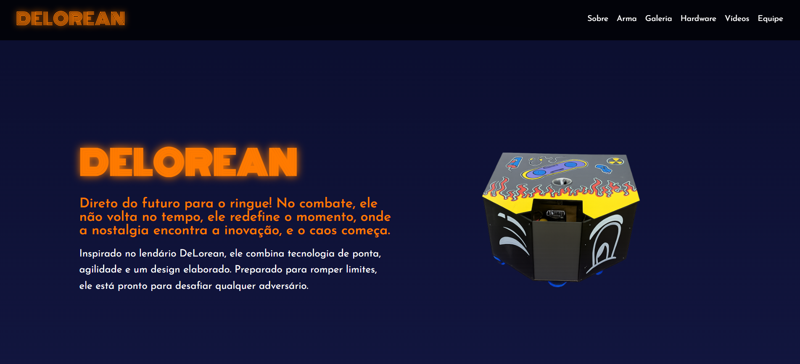

# 🚀 Delorean Website

A web project developed for RoboCup, inspired by the iconic DeLorean.
The goal was to create a modern and futuristic interface to present the robot, its features, and the team behind it.

---

## 🌐 Live Demo

👉 https://ninhasimoes.github.io/Delorean-Website/

---

## 💻 Technologies

* HTML5
* CSS3
* JavaScript

---

## ✨ Features

* Responsive layout
* Image gallery
* Video section
* Team presentation
* Modern and futuristic design

---

## 📸 Project Preview

---

## 👩‍💻 Author

Ana Luiza Simões

